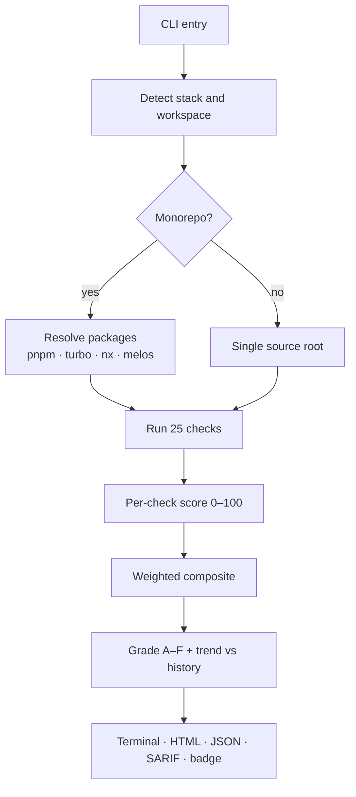
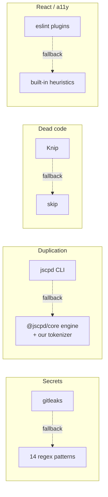
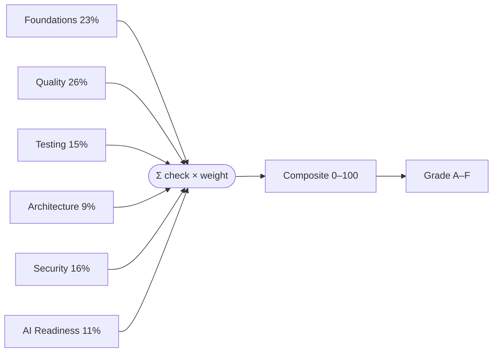

# Architecture

VibeCode QA is a single zero-config CLI. It detects your stack, runs each check in isolation, folds the results into one weighted score, and emits a report. Everything runs locally — nothing is uploaded unless you pass `--upload`.

## The scan pipeline

Each check is an independent runner that takes the project root and returns a `CheckResult` (score, grade, issues, timing). A crash in one runner is contained — it's recorded as errored and the scan continues.

## Tool delegation

Where a best-in-class tool exists, VibeCode QA delegates to it when it's available and falls back to a built-in implementation otherwise — so it always works with zero setup, but gets sharper when you opt in.

The duplication fallback is notable: it runs **jscpd's own `@jscpd/core` Rabin-Karp engine** over a lightweight tokenizer we ship, giving mature maximal-clone detection without bundling jscpd's 2.5 MB language-grammar tokenizer. See [Tool delegation](tools.md).

## How the score is built

Weights sum to 100. The five AI Analysis checks are weight 0 — they surface findings without affecting the score. Full method on the [Scoring](scoring.md) page.

## Output formats

| Format | Flag | Use |
|---|---|---|
| HTML report | _(default)_ | Multi-page report in `.vibe-check/report/` |
| JSON | `--json` | Machine-readable; CI and tooling |
| SARIF | `--sarif` | GitHub Code Scanning / Security tab |
| Badge | `--badge` | shields.io-style SVG |
| Markdown | `--markdown` | Paste into a PR or wiki |

See the [CLI reference](reference.md) for every flag.
