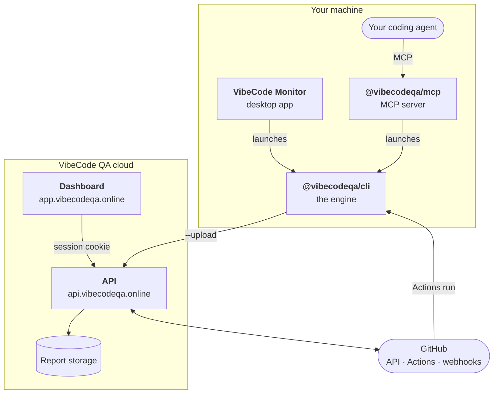
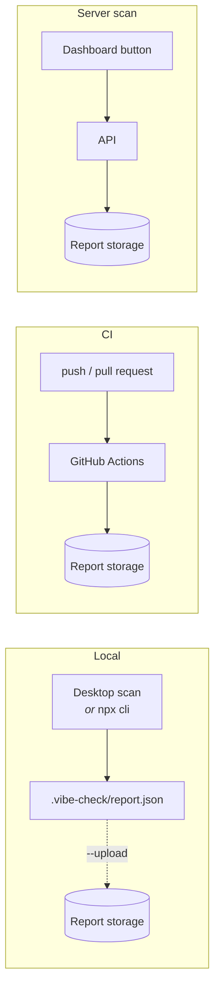
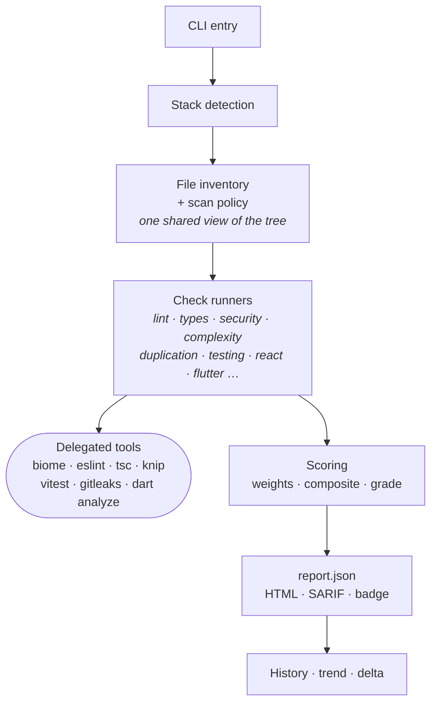
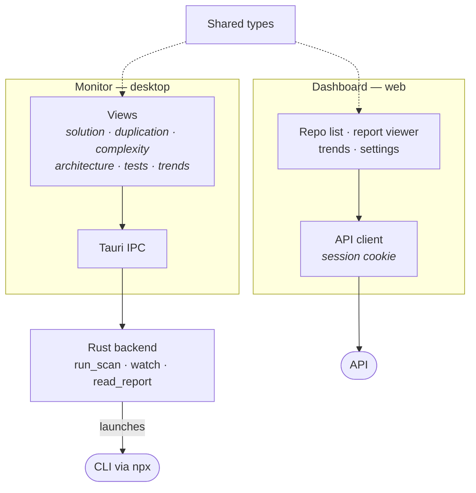
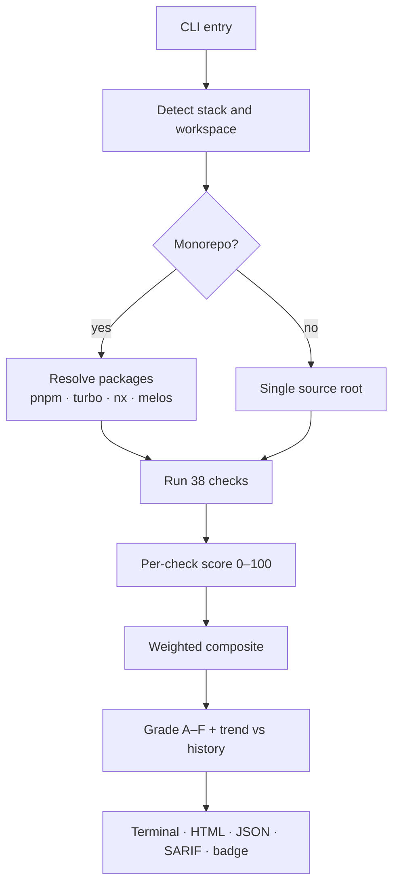
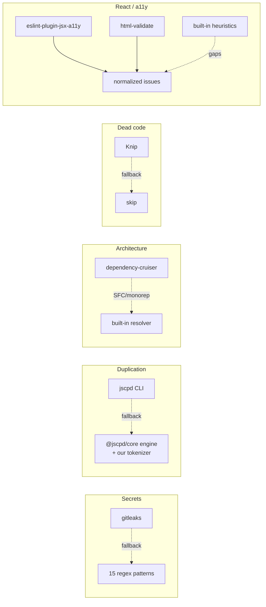
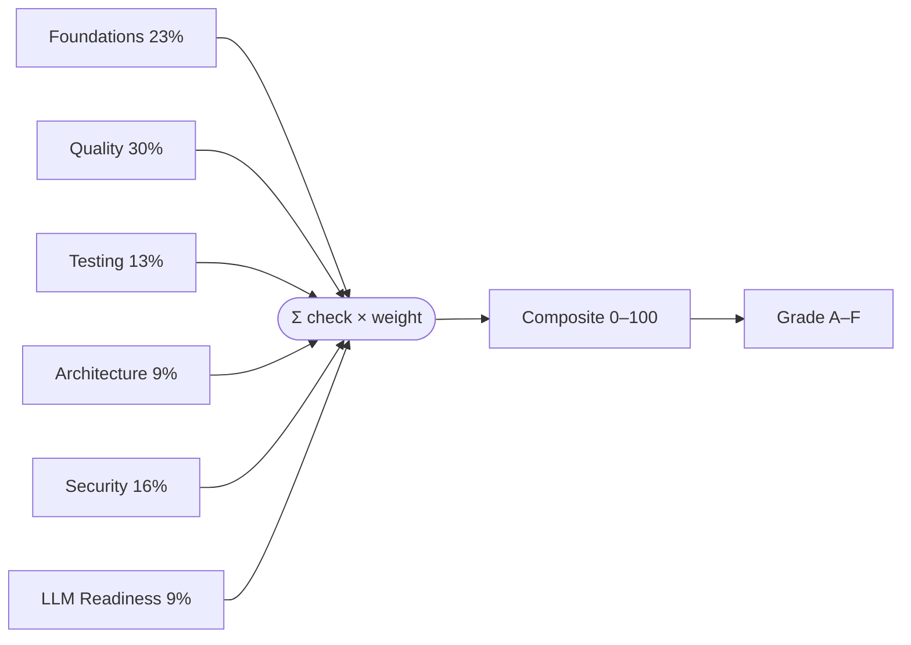

# Architecture

VibeCode QA is a single zero-config CLI. It detects your stack, runs each check in isolation, folds the results into one weighted score, and emits a report. Everything runs locally — nothing is uploaded unless you pass `--upload` with a `VCQA_TOKEN`.

## The surfaces

Five things ship, and only one of them analyses code. The desktop app and the MCP
server do not contain a scanner — they launch the CLI and read the report it writes.
That is deliberate: one engine, several hosts, so a check behaves the same wherever
you run it.

```mermaid
flowchart TB
  subgraph LOCAL["Your machine"]
    CLI["<b>@vibecodeqa/cli</b><br/>the engine"]
    DESK["<b>VibeCode Monitor</b><br/>desktop app"]
    MCPL["<b>@vibecodeqa/mcp</b><br/>MCP server"]
    AGENT(["Your coding agent"])
  end

  subgraph CLOUD["VibeCode QA cloud"]
    WORKER["<b>API</b><br/>api.vibecodeqa.online"]
    KV[("Report storage")]
    APPP["<b>Dashboard</b><br/>app.vibecodeqa.online"]
  end

  GH(["GitHub<br/>API · Actions · webhooks"])

  DESK -->|launches| CLI
  MCPL -->|launches| CLI
  AGENT -->|MCP| MCPL
  CLI -->|"--upload"| WORKER
  GH -->|Actions run| CLI
  APPP -->|session cookie| WORKER
  WORKER --> KV
  WORKER <--> GH
```

| Surface | What it is | Where the analysis happens |
|---|---|---|
| **CLI** | `npx @vibecodeqa/cli` | Here. This is the engine. |
| **Desktop monitor** | Tauri app watching a local folder | Launches the CLI, reads `report.json` |
| **MCP server** | stdio server for coding agents | Launches the CLI |
| **Dashboard** | Hosted web app | Reads stored reports; never analyses |
| **API** | Cloudflare Worker | Stores reports, serves history, runs server-side scans |

### How a report reaches the dashboard

```mermaid
flowchart LR
  subgraph P1["Local"]
    D1["Desktop scan<br/><i>or</i> npx cli"] --> R1[".vibe-check/report.json"]
    R1 -.->|"--upload"| KV1[("Report storage")]
  end
  subgraph P2["CI"]
    D2["push / pull request"] --> A2["GitHub Actions"] --> KV2[("Report storage")]
  end
  subgraph P3["Server scan"]
    D3["Dashboard button"] --> W3["API"] --> KV3[("Report storage")]
  end
```

Local and CI scans run the full engine. The **server scan** is a lighter preview that
reads your repository through the GitHub API without cloning it, so it can give you a
first result with nothing installed and no workflow merged — at a shallower depth than
a full local run. Reports record which produced them.

### Inside the engine

```mermaid
flowchart TB
  ENTRY["CLI entry"]
  DETECT["Stack detection"]
  INV["File inventory<br/>+ scan policy<br/><i>one shared view of the tree</i>"]
  RUNNERS["Check runners<br/><i>lint · types · security · complexity<br/>duplication · testing · react · flutter …</i>"]
  TOOLS(["Delegated tools<br/>biome · eslint · tsc · knip<br/>vitest · gitleaks · dart analyze"])
  SCORE["Scoring<br/>weights · composite · grade"]
  OUT["report.json<br/>HTML · SARIF · badge"]
  HIST["History · trend · delta"]

  ENTRY --> DETECT --> INV --> RUNNERS --> TOOLS
  RUNNERS --> SCORE --> OUT --> HIST
```

The file inventory is the single answer to "what files exist" — runners never walk the
tree themselves, so an ignore rule applies identically to every check. Delegated tools
are why the engine needs a real process environment.

### Inside the desktop app

One codebase ships two things: the hosted dashboard and the desktop monitor. They share
types and little else — the dashboard talks only to the API, the monitor talks only to
the CLI.

```mermaid
flowchart TB
  subgraph WEB["Dashboard — web"]
    WC["Repo list · report viewer<br/>trends · settings"]
    API["API client<br/><i>session cookie</i>"]
  end
  subgraph MON["Monitor — desktop"]
    VIEWS["Views<br/><i>solution · duplication · complexity<br/>architecture · tests · trends</i>"]
    IPC["Tauri IPC"]
  end
  RUST["Rust backend<br/>run_scan · watch · read_report"]
  SHARED["Shared types"]
  WORKER(["API"])
  CLIP(["CLI via npx"])

  WC --> API --> WORKER
  VIEWS --> IPC --> RUST -->|launches| CLIP
  SHARED -.-> WC
  SHARED -.-> VIEWS
```

## The scan pipeline

```mermaid
flowchart TD
  A[CLI entry] --> B[Detect stack and workspace]
  B --> C{Monorepo?}
  C -->|yes| D[Resolve packages<br/>pnpm · turbo · nx · melos]
  C -->|no| E[Single source root]
  D --> F[Run 38 checks]
  E --> F
  F --> G[Per-check score 0–100]
  G --> H[Weighted composite]
  H --> I[Grade A–F + trend vs history]
  I --> J[Terminal · HTML · JSON · SARIF · badge]
```

Each check is an independent runner that takes the project root and returns a `CheckResult` (score, grade, issues, timing). A crash in one runner is contained — it's recorded as errored and the scan continues.

## Tool delegation

Where a best-in-class tool exists, VibeCode QA delegates to it when it's available and falls back to a built-in implementation otherwise — so it always works with zero setup, but gets sharper when you opt in.

```mermaid
flowchart LR
  subgraph Secrets
    S1[gitleaks] -.fallback.-> S2[15 regex patterns]
  end
  subgraph Duplication
    D1[jscpd CLI] -.fallback.-> D2["@jscpd/core engine<br/>+ our tokenizer"]
  end
  subgraph Architecture
    A1[dependency-cruiser] -.SFC/monorepo.-> A2[built-in resolver]
  end
  subgraph Dead code
    K1[Knip] -.fallback.-> K2[skip]
  end
  subgraph React / a11y
    R1[eslint-plugin-jsx-a11y] --> R2[normalized issues]
    R3[html-validate] --> R2
    R4[built-in heuristics] -.gaps.-> R2
  end
```

The duplication fallback is notable: it runs **jscpd's own `@jscpd/core` Rabin-Karp engine** over a lightweight tokenizer we ship, giving mature maximal-clone detection without bundling jscpd's 2.5 MB language-grammar tokenizer. See [Tool delegation](tools.md).

## How the score is built

```mermaid
flowchart LR
  F[Foundations 23%] --> SUM([Σ check × weight])
  Q[Quality 30%] --> SUM
  T[Testing 13%] --> SUM
  AR[Architecture 9%] --> SUM
  SEC[Security 16%] --> SUM
  AI[LLM Readiness 9%] --> SUM
  SUM --> SCORE[Composite 0–100]
  SCORE --> GRADE[Grade A–F]
```

Weights sum to 100 across the 37 checks that carry category metadata. The seven AI Analysis checks are weight 0 — they surface findings without affecting the score, as do the platform-specific zero-weight checks and the synthetic `dead-code` check. Full method on the [Scoring](scoring.md) page.

## Output formats

| Format | Flag | Use |
|---|---|---|
| HTML report | _(default)_ | Multi-page report in `.vibe-check/report/` |
| JSON | `--json` | Machine-readable; CI and tooling |
| SARIF | `--sarif` | GitHub Code Scanning / Security tab |
| Badge | `--badge` | shields.io-style SVG |
| Markdown | `--markdown` | Paste into a PR or wiki |

See the [CLI reference](reference.md) for every flag.

## Hosted dashboard auth

The hosted dashboard uses GitHub OAuth for repo discovery and settings, but the browser never receives the GitHub access token. The API stores the token server-side behind an HttpOnly session cookie, validates OAuth state on callback, and checks GitHub repo permissions before reading settings, uploading manual reports, triggering scans, or showing private report history.

CLI uploads use a separate VibeCode QA platform token (`VCQA_TOKEN`). The CLI falls back to `GITHUB_TOKEN` when `VCQA_TOKEN` is unset and sends whichever it finds as the bearer token; whether the dashboard accepts a GitHub token is a server-side decision this repository cannot verify from the CLI source.

!!! info "Last verified"
    Surfaces, module boundaries, and report paths verified against the four codebases on **2026-08-18**. Pipeline, weights, and output formats verified against `@vibecodeqa/cli` **0.56.0**.
