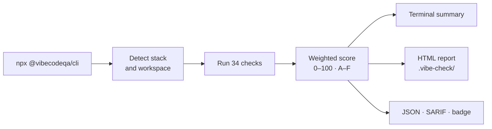

# VibeCode QA

**Code health scanner for the AI coding era.** 34 checks across 7 categories, zero config, a single 0–100 score with a full HTML report — in about five seconds.

```bash
npx @vibecodeqa/cli
```

That auto-detects your stack (TypeScript/JavaScript, React/Vue/Svelte, Node, or Dart/Flutter), runs every check, prints a scored summary, and writes a multi-page HTML report to `.vibe-check/`.

## What you get

<div class="grid cards" markdown>

- :lucide-hash: __One score, graded A–F__

    A weighted composite (0–100) you can track over time, gate CI on, and post to pull requests.

- :lucide-search: __34 checks, 7 categories__

    Foundations, Quality, Testing, Architecture, Security, AI Readiness, and AI Analysis. [See them all](checks.md).

- :lucide-bot: __Built for AI-assisted code__

    Confusion Index and Context Locality measure how easily an LLM can understand and safely edit your code.

- :lucide-file-chart-column: __A full HTML report__

    Architecture diagrams, trend tracking, file hotspots, and a copy-pasteable fix prompt for every issue.

</div>

## How a scan flows



## Next steps

- [The 34 checks](checks.md) — what each one measures, why it matters, and how to fix it
- [Scoring](scoring.md) — how the composite score is calculated
- [Architecture](architecture.md) — how the scanner works under the hood
- [CI integration](ci.md) — quality gates, PR comments, GitHub Actions
- [CLI reference](reference.md) — every command and flag
