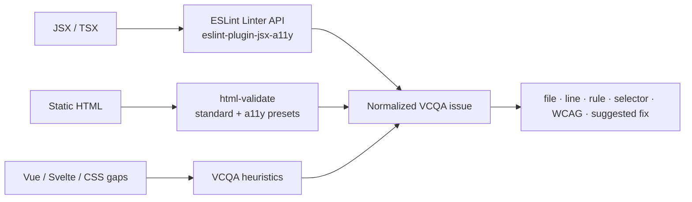
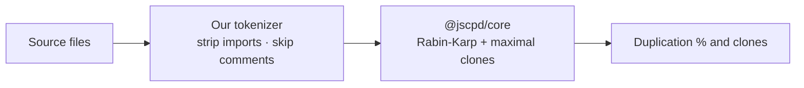

# Tool delegation

VibeCode QA's rule: **use the best dedicated tool when it's present, fall back to a solid built-in otherwise.** You get zero-config results out of the box, and sharper results when you opt into a specialist tool.

| Check | Preferred tool | Built-in fallback |
|---|---|---|
| Secrets | gitleaks | our patterns (incl. OpenAI/Anthropic) **∪ secretlint** + `.env` audit |
| Duplication | jscpd CLI | `@jscpd/core` engine + our tokenizer |
| Architecture | **dependency-cruiser** (bundled) | built-in resolver (SFC / monorepo) |
| Dead code | Knip | skipped |
| React hooks | eslint-plugin-react-hooks | built-in heuristics |
| Accessibility | **eslint-plugin-jsx-a11y** + **html-validate** (bundled) | built-in heuristics for framework/template gaps |
| Security | eslint-plugin-security | 36 CWE-mapped patterns |

The **architecture** check resolves your import graph with [dependency-cruiser](https://github.com/sverweij/dependency-cruiser) — the standard for JS/TS dependency analysis — so cycles, orphans, and god modules are found with real module resolution (tsconfig path aliases included). `.vue`/`.svelte` and monorepo projects fall back to a built-in SFC-aware resolver.

When a specialist plugin is installed (e.g. `eslint-plugin-react-hooks`), the built-in heuristic steps aside to avoid double-reporting. Accessibility is stricter: VCQA bundles the standard static tools and normalizes their findings, then keeps lightweight heuristics for cases those tools do not cover.

## Accessibility: standard tools first

The accessibility check uses maintained static analysis libraries before falling back to VCQA-specific heuristics.



This avoids making our regex scanner the primary source of truth. The built-in heuristics remain for:

- Vue and Svelte template patterns that JSX rules do not see
- icon-only buttons and simple accessible-name gaps
- app-level main landmarks
- heading-order checks across template-like files
- static color pairs in inline styles and CSS
- removed focus outlines without a visible replacement
- positive tabIndex and dialog focus basics

Runtime accessibility is a separate layer. When a project can be built and served, use `axe-core` with `@axe-core/playwright` to audit the rendered DOM, dynamic ARIA state, route-specific landmarks, actual CSS contrast, and keyboard/focus behavior.

## Duplication: a closer look

The duplication fallback is not a naive line-hash. It runs jscpd's own **`@jscpd/core`** — the same battle-tested Rabin-Karp clone-detection engine, with maximal-clone extension — but fed by a **lightweight tokenizer we ship**.



This gives mature Type-1/2 clone detection (50 tokens / 6 lines, jscpd parity) **without** bundling jscpd's 2.5 MB language-grammar tokenizer — roughly 100 KB instead. If you want jscpd's full 223-format tokenizing and HTML reports, install it and VibeCode QA will delegate to the CLI:

```bash
pnpm add -D jscpd
```

## Opting into specialists

```bash
pnpm add -D jscpd knip            # duplication CLI + dead-code
brew install gitleaks             # or: download the binary
pnpm add -D eslint-plugin-security
pnpm add -D @axe-core/playwright @playwright/test # runtime accessibility
```

None are required — they simply raise the ceiling.
