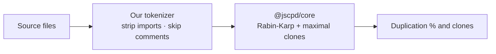

# Tool delegation

VibeCode QA's rule: **use the best dedicated tool when it's present, fall back to a solid built-in otherwise.** You get zero-config results out of the box, and sharper results when you opt into a specialist tool.

| Check | Preferred tool | Built-in fallback |
|---|---|---|
| Secrets | gitleaks | 14 regex patterns + `.env` audit |
| Duplication | jscpd CLI | `@jscpd/core` engine + our tokenizer |
| Dead code | Knip | skipped |
| React hooks | eslint-plugin-react-hooks | built-in heuristics |
| Accessibility | eslint-plugin-jsx-a11y | built-in heuristics |
| Security | eslint-plugin-security | 36 CWE-mapped patterns |

When a specialist plugin is installed (e.g. `eslint-plugin-react-hooks`), the built-in heuristic steps aside to avoid double-reporting.

## Duplication: a closer look

The duplication fallback is not a naive line-hash. It runs jscpd's own **`@jscpd/core`** — the same battle-tested Rabin-Karp clone-detection engine, with maximal-clone extension — but fed by a **lightweight tokenizer we ship**.



This gives mature Type-1/2 clone detection (50 tokens / 6 lines, jscpd parity) **without** bundling jscpd's 2.5 MB language-grammar tokenizer — roughly 100 KB instead. If you want jscpd's full 223-format tokenizing and HTML reports, install it and VibeCode QA will delegate to the CLI:

```bash
pnpm add -D jscpd
```

## Opting into specialists

```bash
pnpm add -D jscpd knip            # duplication CLI + dead-code
brew install gitleaks             # or: download the binary
pnpm add -D eslint-plugin-security eslint-plugin-jsx-a11y
```

None are required — they simply raise the ceiling.
